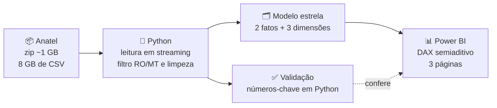
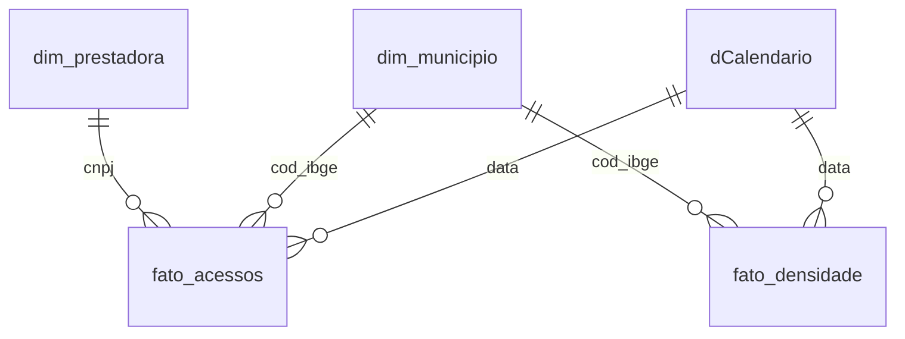

<div align="center">

# 📡 Banda Larga em RO e MT
### Os provedores regionais estão vencendo as grandes operadoras?

Análise de **7 anos de dados abertos da Anatel** · **194 municípios** · **mais de 900 prestadoras**

<br>


<br>

<!-- Adicionar quando estiverem prontos:

🎥 [Vídeo de 3 minutos explicando os achados](LINK_DO_VIDEO) · 📄 [Dashboard em PDF](dashboard/dashboard_banda_larga_ro_mt.pdf)
-->

**[📊 Baixar o dashboard (.pbix)](dashboard/banda_larga_ro_mt.pbix)** &nbsp;·&nbsp; **[📘 Como foi construído](docs/roteiro_dashboard.md)** &nbsp;·&nbsp; **[🐍 Scripts](scripts/)**

</div>

---

## 🎯 Resumo em 10 segundos

> [!IMPORTANT]
> Em **dezembro de 2019**, as grandes operadoras (Oi, Claro, Vivo) tinham **64%** dos acessos de banda larga fixa em Rondônia e Mato Grosso.
> Em **julho de 2026**, os **provedores regionais** têm **68%**. Todo o crescimento do mercado veio deles.

<div align="center">

| 📶 Acessos totais | 🏘️ Share dos regionais | 📈 Ganho desde 2019 | 🚀 Crescimento dos regionais |
|:---:|:---:|:---:|:---:|
| **1,54 mi** | **68,4%** | **+35 p.p.** | **×5** |
| era 628 mil em dez/19 | era 33% em dez/19 | em participação | 208 mil → 1,05 mi |

</div>

---

## ❓ A pergunta de negócio

Donos de provedores de internet (ISPs) do interior querem saber três coisas:

1. **O mercado está mudando?** Quanto os pequenos provedores ganharam das grandes operadoras?
2. **Onde?** Em quais cidades essa virada já aconteceu, e em quais não?
3. **Onde ainda dá para crescer?** Quais municípios têm espaço para um novo provedor ou para expansão?

---

## 🔎 Principais achados

### 1️⃣ O mercado virou, e as grandes operadoras ficaram paradas

Os acessos passaram de 628 mil para **1,54 milhão** (×2,5). Os regionais foram de 208 mil para **1,05 milhão** (×5). As grandes operadoras ficaram no mesmo lugar (403 mil → 392 mil).

| Categoria | dez/2019 | jul/2026 | Variação |
|---|:---:|:---:|:---:|
| 🟢 Provedores regionais | 33% | **68%** | ▲ +35 p.p. |
| ⚪ Grandes operadoras | 64% | 25% | ▼ −39 p.p. |
| 🟠 Satélite | 3% | 6% | ▲ +3 p.p. |

### 2️⃣ Os regionais já lideram em 168 dos 194 municípios

Em cidades médias a virada foi completa: em **Nova Olímpia (MT)**, **Guajará-Mirim (RO)** e **Ouro Preto do Oeste (RO)** o share dos regionais passa de 90%. As exceções são as maiores cidades: em **Porto Velho (57%)** e **Cuiabá (55%)** as grandes ainda detêm a maior parte do mercado.

### 3️⃣ O satélite virou o termômetro da demanda não atendida

Os acessos via satélite foram de ~19 mil (dez/2022) para **95 mil** (jul/2026), puxados pela Starlink, que **lidera em 31 municípios**, quase todos pequenos, de baixa densidade e sem fibra suficiente. Onde o cliente paga mais caro por satélite, há demanda esperando por fibra.

### 4️⃣ O mercado está se consolidando

O maior "provedor regional" já é um grupo consolidador: a **Brasil TecPar**, com 231 mil acessos (×10 desde 2019). Somando os dois estados, ela é maior que Oi, Claro ou Vivo.

---

## 💡 Recomendações para um provedor regional

| # | Oportunidade | Por quê |
|:---:|---|---|
| 1 | **Fibra onde o satélite lidera** | Os 31 municípios liderados pela Starlink têm demanda comprovada e cliente disposto a pagar |
| 2 | **Cidades-polo** | Porto Velho, Cuiabá e Rondonópolis são o último mercado grande ainda das operadoras nacionais, mas exigem escala |
| 3 | **Atenção à consolidação** | Onde um grupo passa de 50% de share, a próxima disputa é por aquisição, não por instalação |

---

## 📊 O dashboard

| Página | O que mostra |
|---|---|
| **Visão geral** | Indicadores do último mês, evolução mensal da participação por categoria e acessos por tecnologia |
| **Municípios** | Mapa de bolhas por coordenadas, tabela com share, líder e concorrência por cidade, top 10 regionais |
| **Oportunidades** | Densidade × participação das grandes, cidades pouco atendidas e evolução do satélite |

Todas as páginas têm filtro por estado, e o título de cada uma é a conclusão, não o nome do gráfico.

---

## ⚙️ Como foi feito



<details>
<summary><b>🧹 Decisões de tratamento que mudam o resultado</b> (clique para abrir)</summary>
<br>

- **Porte da prestadora:** usei a classificação oficial da Anatel (Pequeno/Grande Porte), mas pelo porte **mais recente de cada CNPJ**, aplicado ao histórico. A base original tem inconsistências: em 2021 a Oi aparece como "Pequeno Porte", o que criava um falso salto de até 44 p.p. no share dos regionais naquele ano (RO).
- **Satélite separado:** a Anatel classifica a Starlink como pequeno porte. Sem separar o satélite, ~95 mil acessos inflariam os "provedores regionais", que concorrem com fibra, não com satélite.
- **Tecnologia:** o campo "Tecnologia" muda de nome entre anos ("Fibra" em 2019, "FTTH" depois). Usei o "Meio de Acesso", que é estável.
- **Acessos são estoque, não fluxo:** o total de um período é o do último mês, nunca a soma dos meses (medida semiaditiva no DAX).
- **Densidade:** o PDF de metadados da Anatel diz "por 100 domicílios", mas os valores batem com **acessos por 100 habitantes** (RO: 528 mil acessos com densidade 30 implica ~1,76 mi de pessoas, a população do estado). Rotulei conforme os dados.

</details>

<details>
<summary><b>🗂️ Modelo de dados</b></summary>
<br>



O dashboard também está salvo como **Power BI Project (.pbip)**, com o modelo em TMDL e o relatório em PBIR: tudo em texto, versionável no Git. As medidas DAX estão documentadas em [`docs/roteiro_dashboard.md`](docs/roteiro_dashboard.md).

</details>

---

## ▶️ Como reproduzir

```bash
# 1. Baixe a base da Anatel para data/raw/
#    https://www.anatel.gov.br/dadosabertos/paineis_de_dados/acessos/acessos_banda_larga_fixa.zip

# 2. Instale a dependência
pip install pandas

# 3. Prepare os dados (≈5 min, pouca memória)
python scripts/01_preparar_dados.py

# 4. Gere os números-chave
python scripts/02_analise_exploratoria.py
```

Depois abra `dashboard/banda_larga_ro_mt.pbix` (ou o projeto `.pbip`), ajuste o parâmetro **PastaDados** em *Transformar dados → Editar parâmetros* para a sua pasta `data/processed/` e clique em **Atualizar**.

---

## 📁 Estrutura

```
📦 analise-banda-larga-ro-mt
 ┣ 📂 data
 ┃ ┣ 📂 raw          → base original da Anatel (não versionada) + coordenadas dos municípios
 ┃ ┗ 📂 processed    → tabelas prontas para o Power BI
 ┣ 📂 scripts        → tratamento e análise em Python
 ┣ 📂 dashboard      → .pbix, projeto .pbip (TMDL/PBIR) e tema
 ┣ 📂 docs           → como o dashboard foi construído
 ┗ 📂 img            → prints e GIF
```

---

## 📚 Fontes

- **Anatel, Dados Abertos:** [Acessos de banda larga fixa (SCM)](https://www.gov.br/anatel/pt-br/dados/dados-abertos), jan/2019 a jul/2026
- **Coordenadas dos municípios:** [kelvins/municipios-brasileiros](https://github.com/kelvins/municipios-brasileiros)

---

<div align="center">

### 👤 Jedaías Ismael da Costa
**Analista de dados** · Aberto a projetos freelance de análise de dados e dashboards em Power BI

[](https://github.com/Jeda-Ismael)

</div>
